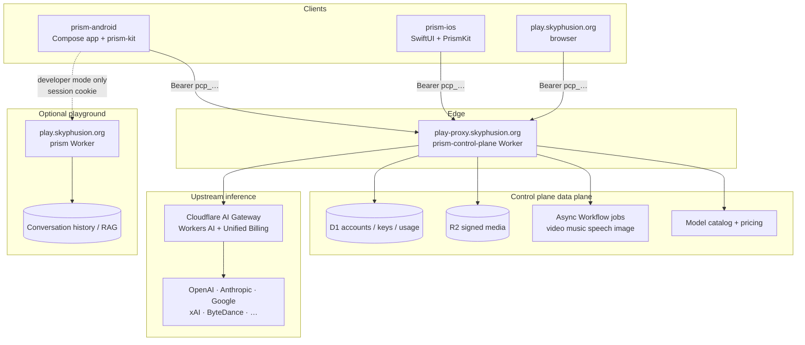
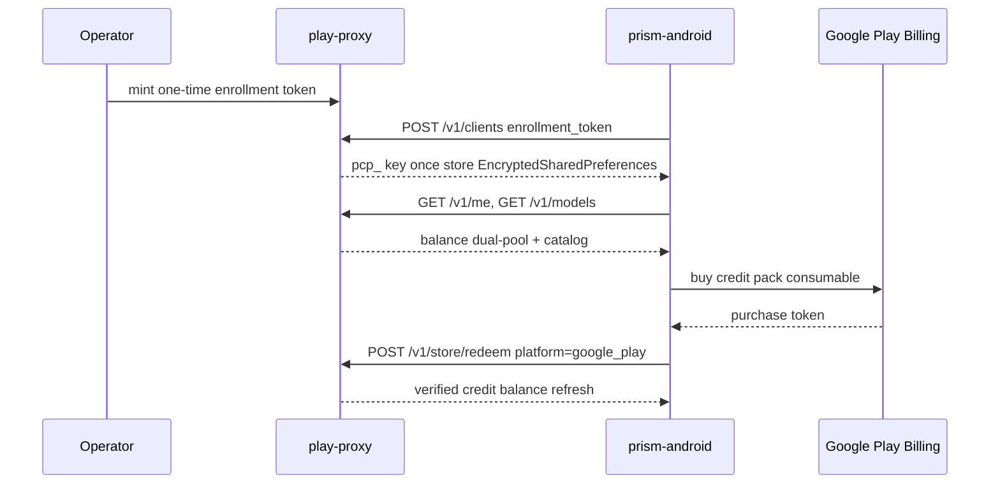
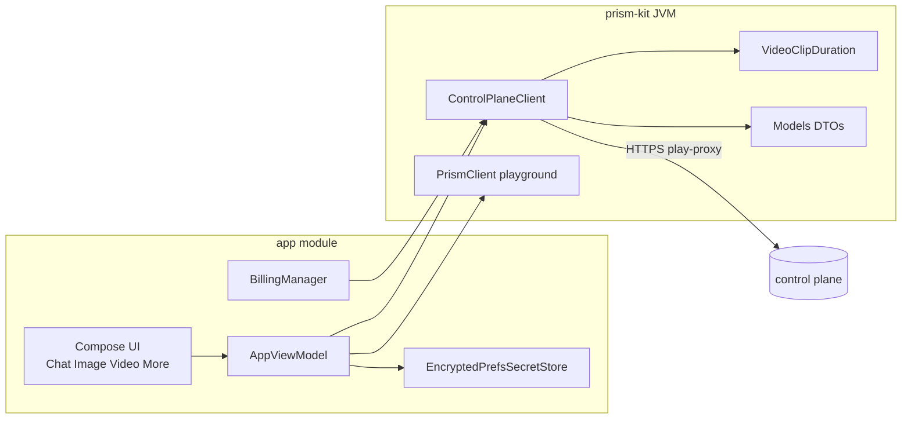
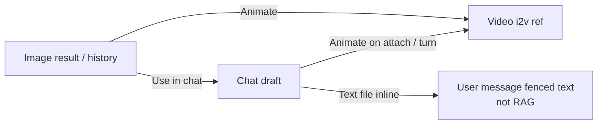

# Architecture -- Prism for Android and the control plane

How **prism-android** fits into the Prism stack: commercial metered inference on
[prism-control-plane](https://github.com/skyphusion-labs/prism-control-plane), optional playground
on [prism](https://github.com/skyphusion-labs/prism), sibling product [prism-ios](https://github.com/skyphusion-labs/prism-ios).

## System context

## Auth and money

Device key format: `pcp_<key_id>_<secret>`. Never logged. On `client_revoked` / 401 the app clears
the key and returns to enroll.

## Inference doors (plane)

| Door | Method / path | Android surface |
|------|----------------|-----------------|
| Chat | `POST /v1/chat/completions` (+ SSE stream) | Chat tab |
| Image | `POST /v1/images/generations` | Image tab |
| Video | `POST /v1/videos/generations` | Video tab + duration picker |
| Speech TTS | `POST /v1/audio/speech` | More → Audio |
| STT file | `POST /v1/audio/transcriptions` JSON `{model,audio}` | Audio + chat mic |
| STT live | `GET /v1/stt/stream` WebSocket | Live STT |
| Music | `POST /v1/music/generations` | More → Music |
| Jobs | `GET /v1/jobs/:id` | poll after Prefer: respond-async |
| Usage | `GET /v1/usage`, `GET /v1/me` | More → Usage, balance chips |
| Redeem | `POST /v1/store/redeem` | Settings top-up |

Long-run media (video, music, speech, gpt-image-2) uses **Prefer: respond-async** → 202 job id →
poll until terminal. Job ids persist across process death; **forceSync** on foreground resume.

## App modules

| Module | Role |
|--------|------|
| `prism-kit` | Pure JVM HTTP client, DTOs, duration catalog, secret key names |
| `app` | Compose shell, enroll, tabs, billing, biometric lock, widgets |

## Cross-modal handoffs (1.0)

## Privacy / data residency

- **Plane chat transcript:** client-owned (device sessions + export). Plane meters tokens; does not store chat history for plane clients.
- **Playground mode (developer):** server conversations on the Worker; media doors disabled.
- **Keys:** Android Keystore-backed EncryptedSharedPreferences only.
- **Legal:** AGPL-3.0-only; privacy https://skyphusion.org/privacy.html

## Related contracts

- Plane OpenAPI / CONTRACT: control-plane `docs/`
- Model list snapshot: [MODELS.md](MODELS.md)
- Play Internal beta: [PLAY-INTERNAL.md](PLAY-INTERNAL.md)
- Release: [RELEASE-1.0.md](RELEASE-1.0.md)
